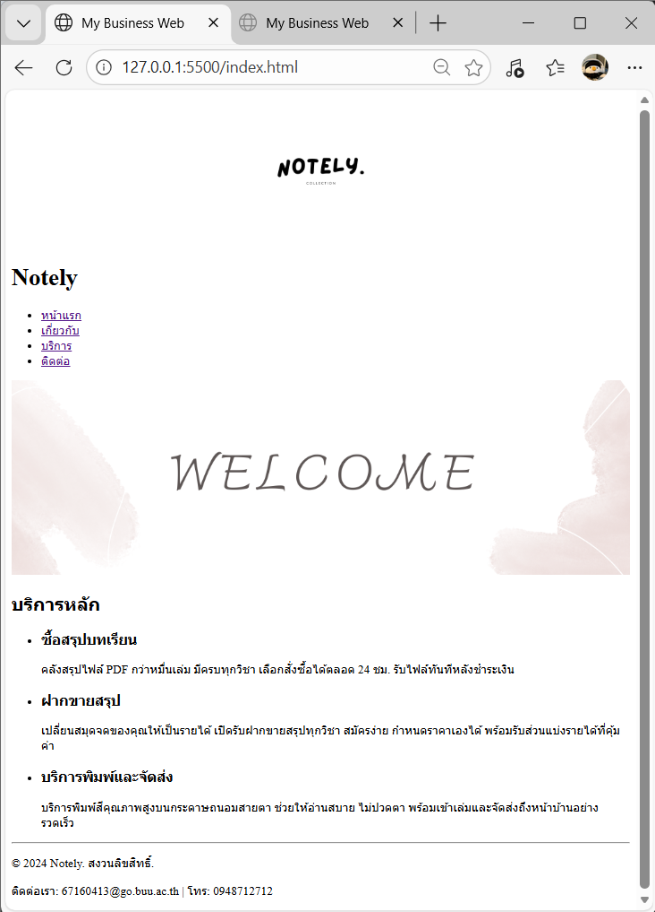
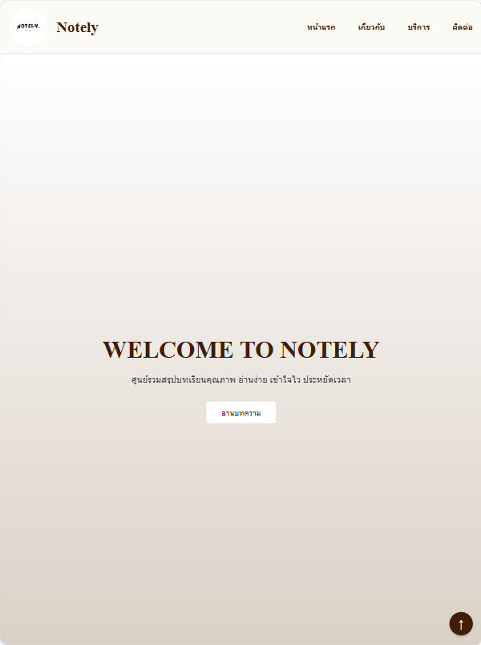
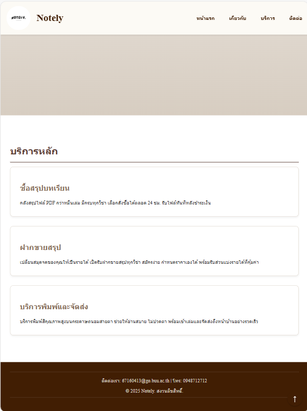
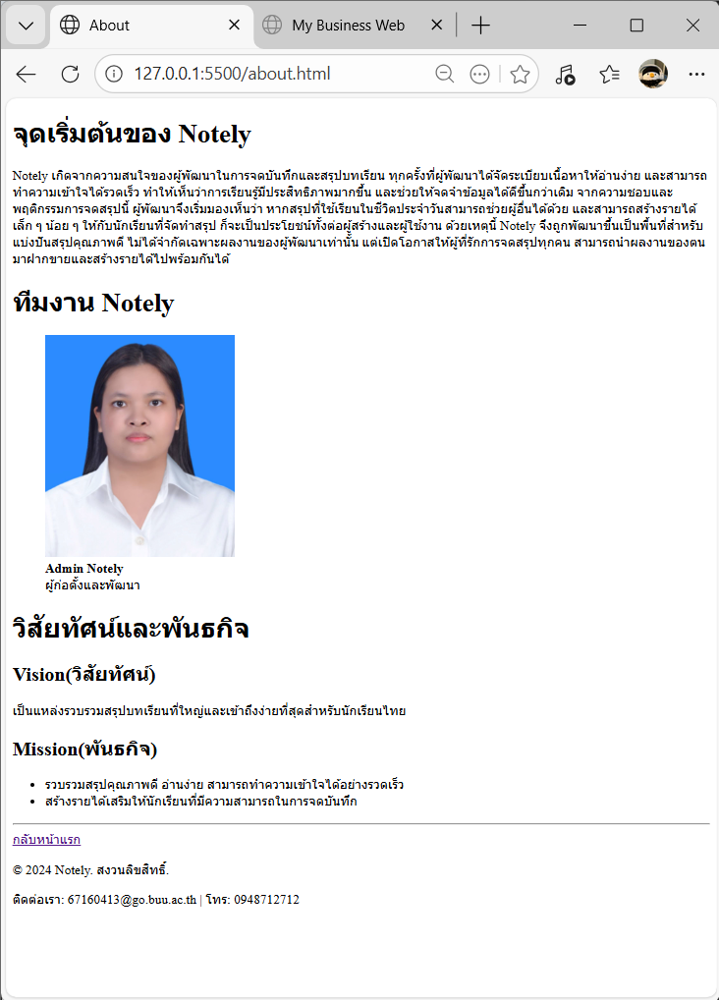
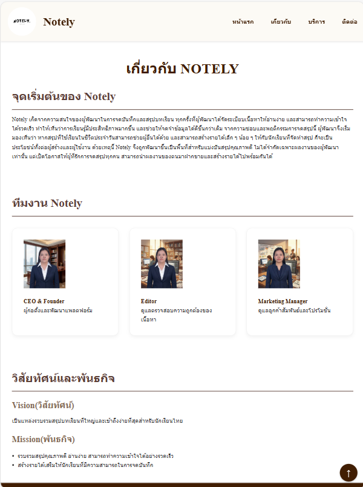
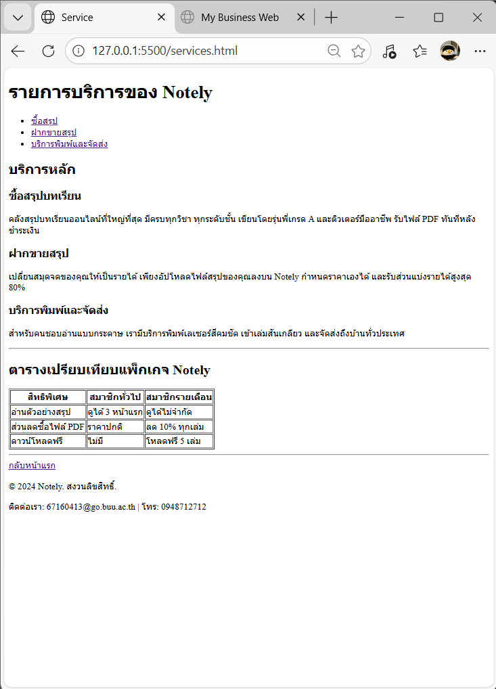
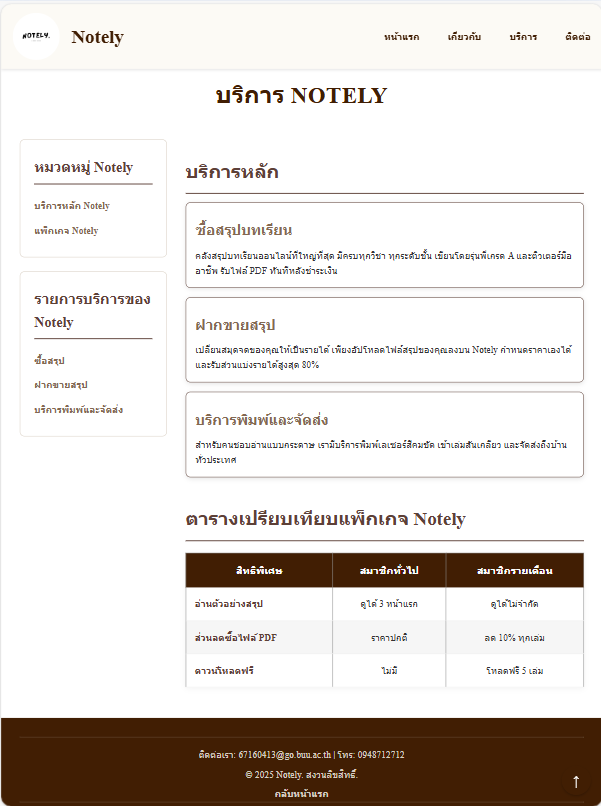
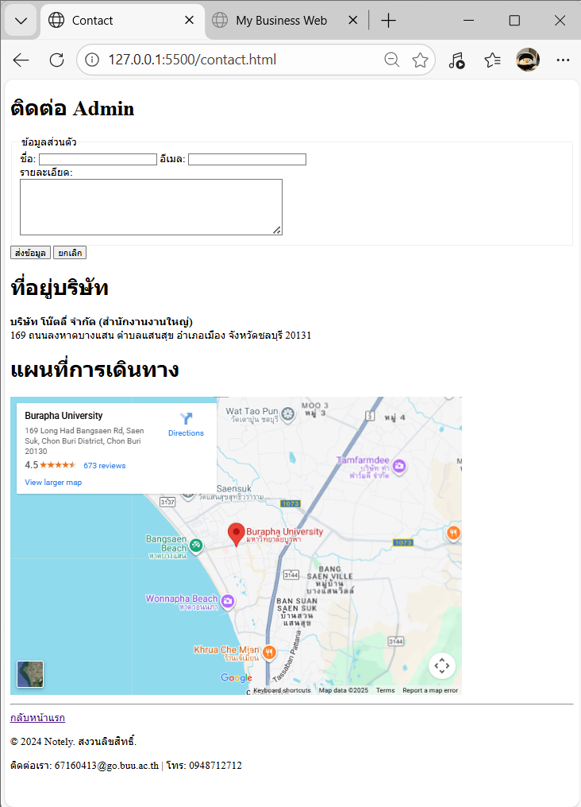
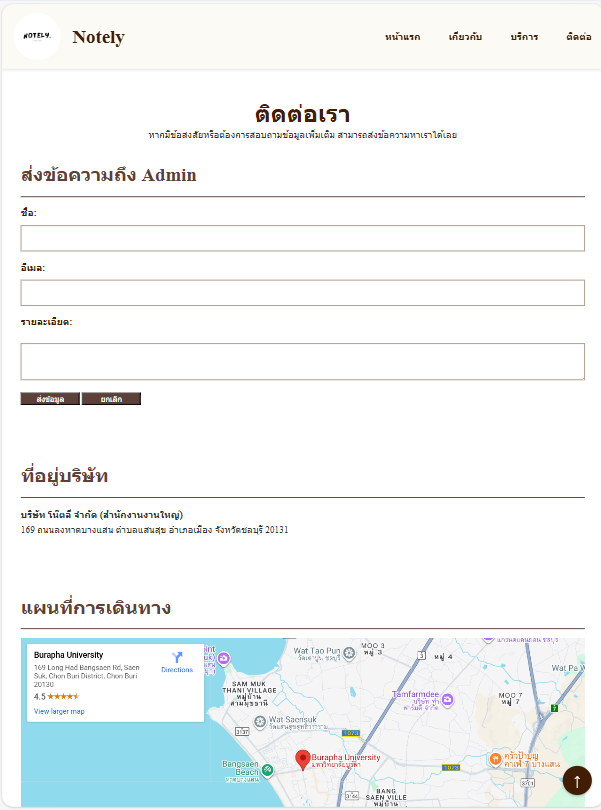

# Notely - เว็บไซต์ซื้อขายสรุปบทเรียนออนไลน์

**Notely** คือ แพลตฟอร์ม Marketplace สำหรับซื้อและขายสรุปบทเรียนคุณภาพดี ครอบคลุมเนื้อหาทั้งระดับประถมศึกษา มัธยมศึกษา และมหาวิทยาลัย ช่วยให้นักเรียนเข้าถึงความรู้ได้ง่ายขึ้น พร้อมสร้างรายได้ใให้กับผู้ที่มีทักษะการจดบันทึก

## โครงสร้างไฟล์

```text
my-business-web
├── index.html
├── about.html
├── services.html
├── contact.html
├── css/
│   └── styles.css
│
├── images/
│   ├── logo.png
│   ├── screen-about.png
│   ├── screen-contact.png
│   ├── screen-home.png
│   ├── screen-services.png
│   ├── team-member-1.png
│   ├── team-member-2.png
│   ├── team-member-3.png
│   ├── screen-about-after.png
│   ├── screen-contact-after.png
│   ├── screen-services-after.png
│   ├── screen-home-after01.png
│   └── screen-home-after02.png
│
├── README.md
└── .gitignore
```

## รูปหน้าจอทั้งหมด

### 1. หน้าแรก

**ก่อนแก้ไข**
<br/>

<br/>
**หลังแก้ไข**
<br/>

<br/>


### 2. เกี่ยวกับ

**ก่อนแก้ไข**
<br/>

<br/>
**หลังแก้ไข**
<br/>

<br/>

### 3. บริการ

**ก่อนแก้ไข**
<br/>

<br/>
**หลังแก้ไข**
<br/>

<br/>

### 4. ติดต่อ

**ก่อนแก้ไข**
<br/>

<br/>
**หลังแก้ไข**
<br/>

<br/>

## ลิงค์เข้าสู่หน้าต่าง

- [หน้าแรก](index.html)
- [เกี่ยวกับเรา](about.html)
- [บริการของเรา](services.html)
- [ติดต่อเรา](contact.html)
- [CSS](css/styles.css)
